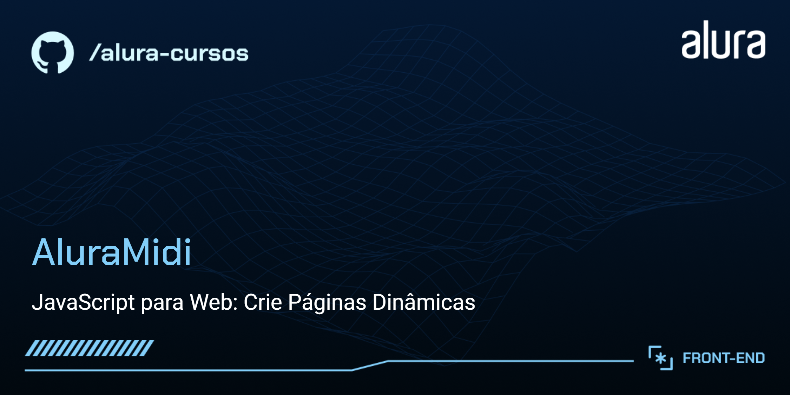

# AluraMidi

App musical, com várias teclas que tocam diferentes sons conforme a interação do usuário.
 
Do curso da Alura "JavaScript para Web: Crie Páginas Dinâmicas".

## 🔨 Funcionalidades do projeto

App em HTML e CSS, com interatividade através do JavaScript, apresentando várias teclas que tocam diferentes sons conforme a interação do usuário.

## ✔️ Técnicas e tecnologias utilizadas

As técnicas e tecnologias utilizadas pra isso são:

-  : construção do conteúdo da página
-  : estilização da página e responsividade
-  : interatividade da página
-  : fonte do projeto UI / UX
-  : controle de versão
-  : repositório do código
-  : hospedagem do site
-  : IDE

## 📁 Acesso ao projeto

Você pode acessar o resultado do projeto [aqui](#).
